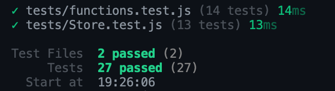

# JavaScript Core Lab 4

This repository contains my solution for Lab 4.

## How to run tests

Install dependencies:

```bash
npm i
All tests should pass successfully with:

```bash
npm test

добавь:

```md
### Test result


